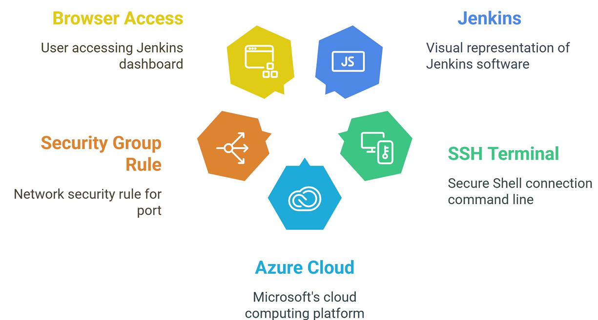

# 🚀 Jenkins Deployment on Azure Linux Virtual Machine

<p align="center">
  
  <br/><br/>
  
</p>

This project demonstrates how to deploy a simple Jenkins application on a Linux-based Virtual Machine (VM) hosted on Microsoft Azure. The VM is configured using a cost-efficient B-series size and accessed via SSH. Jenkins is installed and made accessible through port **8080** on the VM's public IP.

---

## 🛠️ Prerequisites

Before starting, ensure the following:

- An active [Microsoft Azure](https://portal.azure.com/) account.
- A Linux-based VM (e.g., Ubuntu) created in Azure using a **B-series** size.
- Port **8080** opened in the VM's **Network Security Group (NSG)**.
- A `.pem` private key file downloaded if SSH authentication is used.

---

## 📦 Steps to Deploy Jenkins

### 1. Connect to the Azure VM via SSH
📌 Description:
Connects securely to your Azure VM using SSH. Replace /path/to/your/key.pem, vmusername, and public_ip_of_vm accordingly.

```bash
ssh -i /path/to/your/key.pem vmusername@public_ip_of_vm
```
### 2. Update the Package Repository
📌 Description:
Updates the local package index to ensure you're installing the latest versions of available packages.
```bash
sudo apt update
```
### 3. Install Java Runtime Environment (OpenJDK 17)
📌 Description:
Jenkins requires Java to run. This command installs the OpenJDK 17 runtime.
```bash
sudo apt install openjdk-17-jre
```
### 4. Verify Java Installation
📌 Description:
Confirms that Java is installed and displays the installed version.
```bash
java -version
```
### 5. Install Jenkins
📌 Description:
These commands add the Jenkins repository to your system, update the package index, and install Jenkins.
```bash
curl -fsSL https://pkg.jenkins.io/debian/jenkins.io-2023.key | sudo tee \
  /usr/share/keyrings/jenkins-keyring.asc > /dev/null

echo deb [signed-by=/usr/share/keyrings/jenkins-keyring.asc] \
  https://pkg.jenkins.io/debian binary/ | sudo tee \
  /etc/apt/sources.list.d/jenkins.list > /dev/null

sudo apt-get update
sudo apt-get install jenkins
```
### 6. Check if Jenkins is Running
📌 Description:
Verifies whether the Jenkins service is running on your VM.
```bash
ps -ef | grep jenkins
```
## 🌐 Accessing Jenkins:
 ### Once Jenkins is installed and running:

1. Open your web browser.

2. Visit: ```http://<public_ip_of_vm>:8080```

📌 Replace <public_ip_of_vm> with the actual public IP address of your Azure VM.


