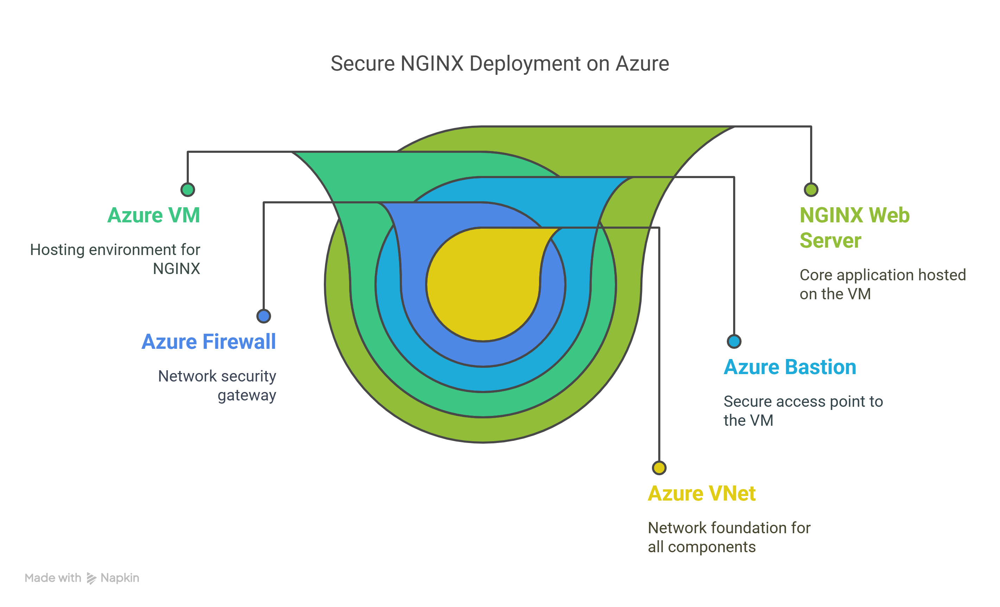

  

# 🚀 Secure NGINX Deployment on Azure VM via Bastion with DNAT Firewall Rules

This project demonstrates a secure method of deploying an NGINX web server on an Azure Linux Virtual Machine (B-series), with **no public IP** assigned to the VM. Instead, the VM is accessed via **Azure Bastion** for SSH, and the application is made accessible externally using **Azure Firewall with DNAT rules**.

---

## 📘 Overview

- **Objective:** Deploy a secure NGINX application in Azure without exposing the VM directly to the internet.
- **Access Method:** Azure Bastion for SSH access.
- **Networking:** Azure VNet, subnets, firewall, and Bastion.
- **Security:** DNAT rules in Azure Firewall to allow restricted access to NGINX.
- **Use Case:** Demonstrates Azure networking concepts like perimeter control, segmentation, and secure VM management.

---

## 🔧 Bastion SSH Commands & Descriptions

SSH into the VM using **Azure Bastion** and execute the following commands:

| Command | Description |
|--------|-------------|
| `sudo su -` | Switches to the root user for elevated privileges. |
| `apt-get update` | Updates the package list to fetch the latest versions of available packages. |
| `apt-get install nginx -y` | Installs the NGINX web server and auto-confirms the prompt. |
| `cd /var/www/html` | Navigates to the default NGINX web root directory. |
| `vim index.html` | Opens the `index.html` file for editing the default homepage content. |
| _Inside vim, write:_ `<h1> I learnt Azure Networking </h1>` | Adds a simple HTML message to the NGINX home page. |
| _Type_ `:wq` _to save and exit vim_ | Saves changes and exits the vim editor. |
| `systemctl restart nginx` | Restarts the NGINX service to apply changes. |
| `curl localhost:80` | Verifies that the NGINX server is running and serving the HTML content locally. |

---

## 🔒 DNAT Rules Configuration (Azure Firewall)

To allow external users to access the NGINX app securely via Azure Firewall, a **DNAT rule** is configured:

| Parameter | Value |
|----------|-------|
| **Priority** | 100 |
| **Rule Collection Name** | `firewall-nginx-rule` |
| **Rule Name** | `nginx-rule` |
| **Source IP** | Your Public IP (restricted access) |
| **Source Port** | 4000 |
| **Protocol** | TCP |
| **Destination IP** | Public IP of Azure Firewall |
| **Translated Address** | Private IP of the VM |
| **Translated Port** | 80 |
| **Rule Type** | DNAT |

This DNAT rule ensures that traffic from your IP to **FirewallIP:4000** is securely forwarded to the internal NGINX server on port 80.

---

## 📐 Architecture Overview

